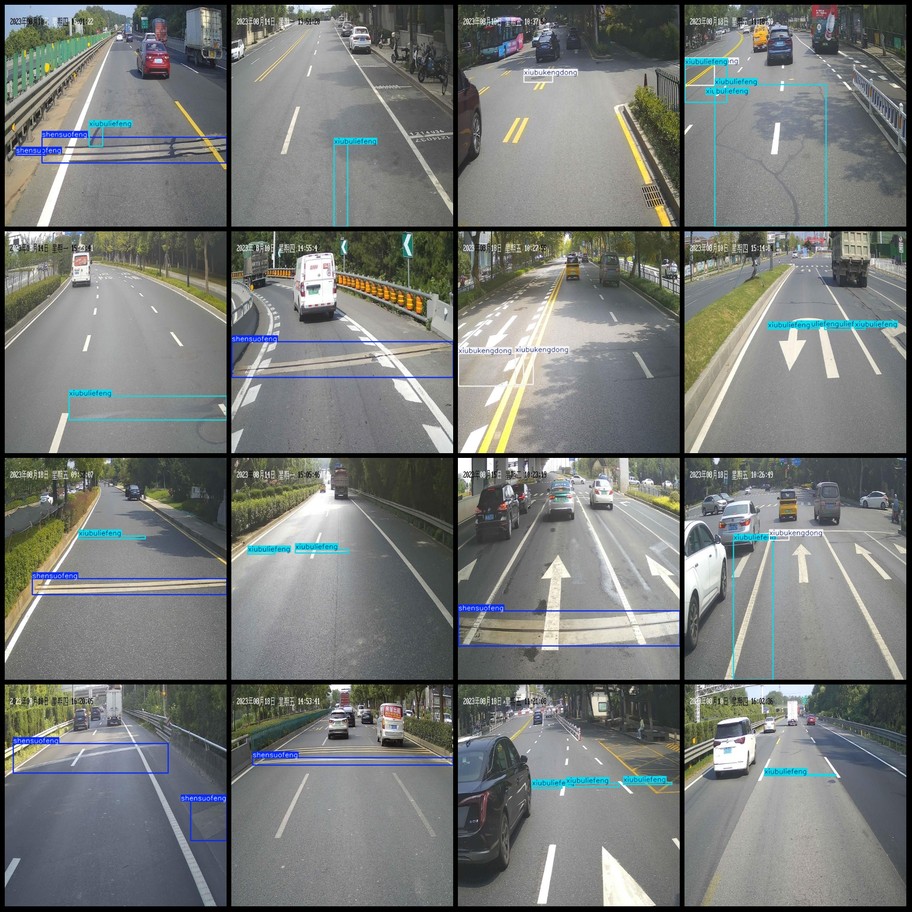
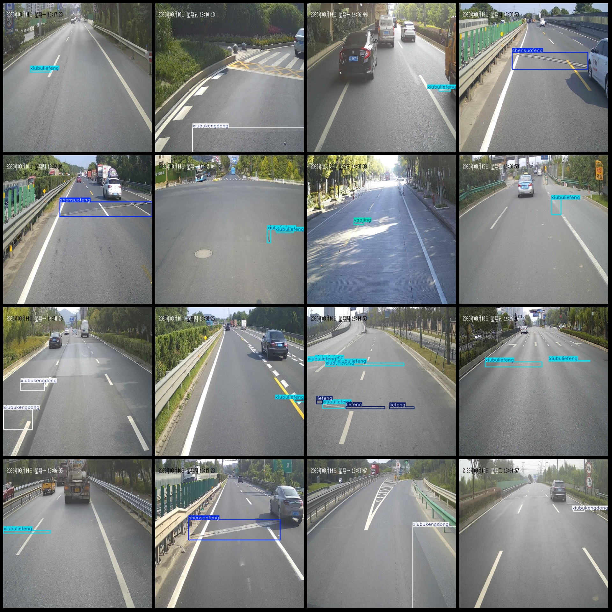

# Smart Traffic Road Cracks and Holes Warning Pole and Well Target Detection Data Set VOC+YOLO Format 4957 Images 27 Categories

dataset format: Pascal VOC format+YOLO format (without split path in txtfile, only contain jpgimage and corresponding VOC format xmlfile and yolo format txtfile)
number of images: 4957  
Labeled quantity (number of xml files): 4957
4957
Category count: 27
Annotation class names: ["Line Not Clear", "License Plate", "Road Aisle", "Road Spillage", "Electronic Sign", "Wide Angle Lens", "Speed Pad", "Traffic Sign", "Traffic Light", "Warning Pole", "Warning Trash Can", "Warning Cone", "Puddle", "Ditch", "Trash Can", "Crack", "Side Box", "Lamp Post", "Broken Paving Board", "Flexible Seam", "Cement Fence"]
Plastic guardrail, mesh crack, patch hole, patch crack, patch mesh, well
1. Unclear road markings
2. License plates
3. Roadside signs
4. Road debris
5. Electronic signs
6. Wide-angle mirror
7. Speed humps
8. Traffic signs
9. Traffic lights
10. Warning poles
11. Warning barrels
12. Warning cones
13. Waterlogging
14. Holes
15. Trash cans
16. Cracked pavement
17. Side boxes
18. Streetlights
19. Broken paving stones
20. Expanding joints
21. Concrete barriers
22. Plastic barriers
23. Weave cracks
24. Repair pits
25. Repair cracks
26. Repair weave
"Nesting well"]
Number of boxes annotated in each category:
biaoxianbuqing box count = 1  
"chepai box count = 131"
The number of daolumenjia frames = 1.
"Daoluyisa Frame Number = 36"
"dianzibiaozhi box count = 3"
guangjiaojing box count = 1  
jiansudai box count = 19  
jiaotongbiaozhi box count = 25  
jiaotongdeng box count = 2  
jingshigao box count = 766  
jingshitong box count = 4  
jingshizhui box count = 41  
jishui box count = 1  
Kendon box count = 20
Lajitong frame count = 11
liefeng box count = 935  
Lubianxiang frame number = 12
"ludeng box count = 1"
The number of Posiban boxes is 1.
shensuofeng box count = 1811  
shuinihulan box count = 2  
suliaohulan box count = 7  
wangzhuangliefeng box count = 15  
xiubukengdong box count = 1418  
xiubuliefeng box count = 4184  
"xiubuwangzhuang" is a Chinese phrase that translates to "Xiubu Wangzhuang" or simply "Xiubu" in English. The phrase "box count = 7" seems to be an equation or statement, but it lacks context and cannot be accurately translated without additional information.
yaojing box count = 142  
Total frame count: 9597
images per class:   
biaoxianbuqing,chepai,daolumenjia,daoluyisa,dianzibiaozhi,guangjiaojing,jiansudai,jiaotongbiaozhi,jiaotongdeng,jingshigao,jingshitong,jingshizhui,jishui,kengdong,lajitong,liefeng,lubianxiang,ludeng,
Total number of frames: 9597
Number of images per category:
biaoxianbuqing,chepai,daolumenjia,daoluyisa,dianzibiaozhi,guangjiaojing,jiansudai,jiaotongbiaozhi,jiaotongdeng,jingshigao,jingshitong,jingshizhui,jishui,kengdong,lajitong,liefeng,lubianxiang,ludeng,
posuiban,shensuofeng,shuinihulan,suliaohulan,wangzhuangliefeng,xiubukengdong,xiubuliefeng,xiubuwangzhuang,yaojing
## Image

Here is a pay link on Stripe ( https://buy.stripe.com/3cs8yP7sY87d0vu9AB ). Please contact me lonlonago@foxmail.com after funding $89, and I will send you a complete data files , thank you!

